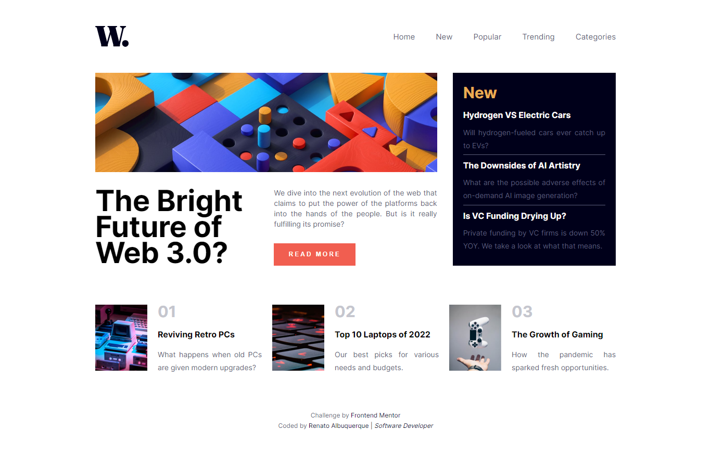

# Frontend Mentor - News homepage solution

This is a solution to the [News homepage challenge on Frontend Mentor](https://www.frontendmentor.io/challenges/news-homepage-H6SWTa1MFl). Frontend Mentor challenges help you improve your coding skills by building realistic projects. 

The focus of this project was to apply/understand GRID concepts in CSS. Project made for a 1000px screen. Some CSS GRID properties applied in the project: grid-template-columns, grid-template-areas, grid-area.

## Table of contents

- [Overview](#overview)
  - [The challenge](#the-challenge)
  - [Screenshot](#screenshot)
  - [Links](#links)
- [My process](#my-process)
  - [Built with](#built-with)
- [Author](#author)

## Overview

### The challenge

Users should be able to:

- View the optimal layout for the interface depending on their device's screen size (to be done)
- See hover and focus states for all interactive elements on the page

### Screenshot

### Links

- Solution URL: (https://github.com/renato-albuquerque/news-homepage)
- Live Site URL: (https://renato-albuquerque.github.io/news-homepage/)

## My process

### Built with

- Semantic HTML5 markup
- CSS custom properties
- Flexbox
- CSS Grid

## Author

- Business Card - [Renato Albuquerque](https://rma-contacts.vercel.app/)
- Linkedin - [renato-malbuquerque](https://www.linkedin.com/in/renato-malbuquerque/)
- Discord - [Renato Albuquerque#0025](https://discordapp.com/users/992621595547938837)